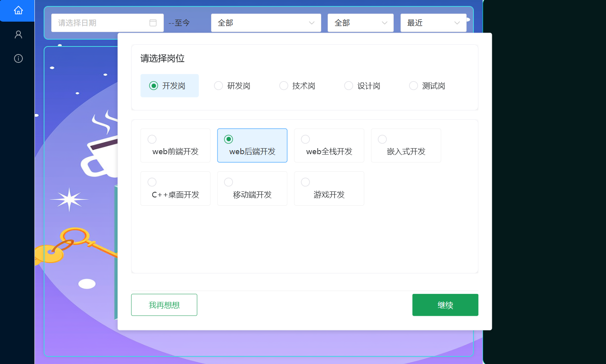
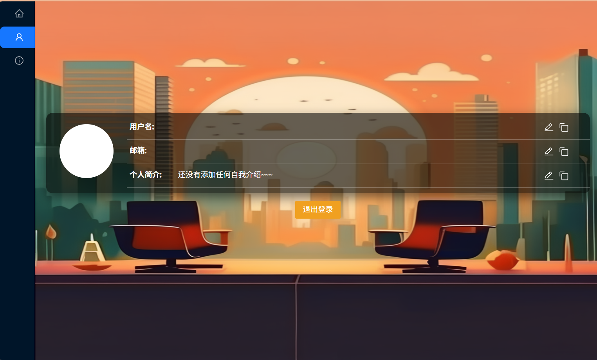
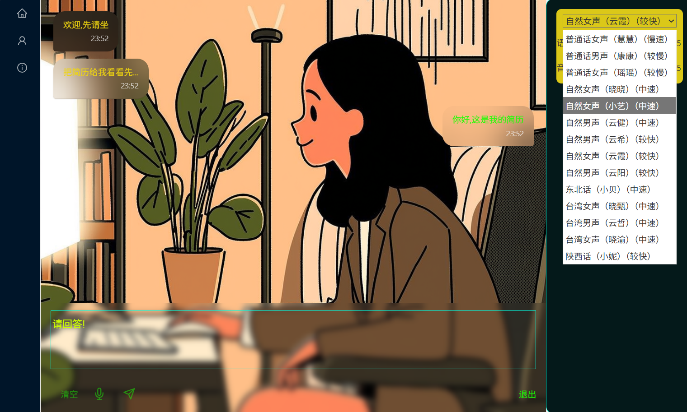

# 面试达人

## 仓库代码结构

```text
.
├── README.md                         # 项目说明文档
├── interview-aissistant/             # 前端（Vue 3 + Vite）
│   ├── src/
│   │   ├── main.js                   # 前端入口
│   │   ├── App.vue                   # 根组件
│   │   ├── router/                   # 路由配置
│   │   ├── store/                    # 全局状态（Vuex）
│   │   ├── views/                    # 页面级视图（首页、登录、设置、社区等）
│   │   ├── components/               # 业务组件（实时面试、报告、简历编辑等）
│   │   ├── utils/                    # 工具模块（请求封装、评分、录音、OpenCV等）
│   │   └── assets/                   # 静态资源
│   ├── public/model/                 # 前端用到的模型资源
│   ├── package.json                  # 前端依赖与脚本
│   └── vite.config.js                # Vite 构建配置
├── interview_backend/                # 后端（FastAPI + AI能力）
│   ├── main.py                       # 后端服务入口
│   ├── config.py                     # 配置项
│   ├── database.py                   # 数据库连接/操作
│   ├── interview.py                  # 面试核心流程逻辑
│   ├── spark_client.py               # 星火大模型调用封装
│   ├── voice1.py / voice2.py         # 音频处理相关模块
│   ├── vedio1.py / vedio2.py         # 视频分析相关模块
│   ├── FileManager.py                # 文件管理工具
│   ├── uploads/                      # 上传文件存储（如头像）
│   ├── tmp/                          # 临时音频文件
│   ├── requirements*.txt             # Python 依赖清单
│   └── other/                        # 实验性/历史脚本与分析器代码
├── package-lock.json                 # 根目录历史 npm 锁文件
└── .env / .env_secret                # 环境变量与密钥（本地配置，不应泄露）
```

### 目录补充说明

- `interview-aissistant/src/views` 负责页面路由对应的完整界面。
- `interview-aissistant/src/components` 负责可复用功能模块（面试会话、报告展示等）。
- `interview_backend/main.py` 对外提供 API，调用 `interview.py`、`voice*.py`、`vedio*.py` 等能力模块。
- `interview_backend/other` 主要是测试、备份和实验代码，正式运行通常不依赖此目录。

## 预览

<div>
  
  
  
</div>

<div style="margin-top: 8px;">
  
  
</div>

## 运行

### 后端

1. 确保python版本为3.12.0(最好已添加至系统环境变量)

2. 首次运行双击`build.bat`构建虚拟环境,然后双击`init_run.bat`运行。如有误，则可在cmd界面手动输入bat脚本中的指令查看具体报错信息
   
3. 后续运行可直接双击`run.bat`

### 前端

首次在`interview-aissistant`目录下运行`npm install`安装依赖，然后运行`npm run dev`启动项目，后续就双击`run.bat`

## 技术栈

### 前端
Vue 3

### 后端
⚡ FastAPI – 轻量高性能 Web 框架

🐬 MySQL 数据库：使用 [sqlpub](https://www.sqlpub.com) 管理

### 智能体系统
🌟 讯飞星火大模型
用于智能问答 + 人脸识别

😊 DeepFace
进行表情识别（Emotion Recognition）

🗣️ pyAudioAnalysis
语音特征提取

🎙️ SenseVoiceSmall（modelscope）
语言情感识别（[GitHub 仓库](https://github.com/FunAudioLLM/SenseVoice)）


🔐 其他
所有相关密钥均保存在以下文件中：

.env

.env_secret

* 项目中的图片都由通义万祖生成
